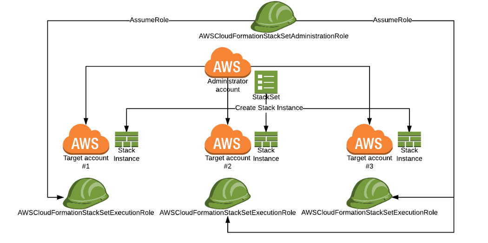

# Automating RDS Snapshot Backup to a 'FailSafe' Account

## Benefits

1. Reduces the identified Risk of losing Prod assets because of intended or unintended damage (deletion) of assets by people or resources with legitimate access to Prod AWS Account.
2. Encourages thinking on DR and understanding of environments via thorough documentation
3. Increased confidence and better expectations management for the Business around recovery of data
4. Increased knowledge on the RDS Service and what it has to offer on Cross Account backups


## Background

Disaster recovery (DR) is often thought of in terms of handling massive failures of infrastructure - the loss of a whole data centre for example. In AWS, these kinds of failures are usually mitigated by architectures that allow technical solutions to span multiple Availability Zones  and Regions. However, there are other kinds of 'disasters' including the accidental or intentional mass deletion of resources by people who have legitimate access to an AWS account.
This kind of 'disaster' can be mitigated by saving copies of key resources - AMIs, CloudFormation templates, encryption keys and instance & RDS snapshots - to a second 'Failsafe' account to which there is limited and carefully controlled access. Such control could be maintained by splitting the password and the MFA device across multiple members of staff, requiring two to be present before access is possible.
The SAM Stack provided here offers a way of taking a daily copy of the most recent Automated RDS Snapshots. This could from be one or more RDS instances in a Live AWS Prod Account to an AWS 'Failsafe' Account. The 'Failsafe' Account has restricted / limited access granted to People and Services.

## Solution for RDS Backup

The target RDS Database is tagged with a special tag {Key:"Failsafe", Value:"True"}. Apart from deploying the Stack across AWS Accounts this is the only manual work required to enable 'Failsafe' backups.
This target RDS Database should have automatic snapshot creation enabled via the AWS console. AWS RDS creates automated backups of the DB instance during the backup window. AWS RDS saves the automated backups of the DB instance according to the backup retention period that is specified.

When an automated backup is run, a payload is sent to an SNS Topic by the RDS Event Subscription. This event kicks off the Lambda function to Copy and Share the RDS Snapshot accross accounts. The "Copy Lambda" function in the target Account checks whether the "failsafe" targed RDS has automated snapshots that have not been backed-up to the 'Failsafe' account yet. If there are then a manual copy of the automated snapshot is created.  The manual snapshot is shared to the Failsafe account. The "Save Lambda" function in the Failsafe account will then copy this snapshot and keep it for the specified retention period.
The illustration below demonstrates how this process is tied together:


###### Key Steps:
1. Amazon RDS in the Prod AWS Account is configured to create and save automated backup snapshots of DB instances
2. There is an SNS Topic configured in the Prod AWS Account that receives an Event when RDS Automated Backup Starts/Ends. It triggers the Lambda function to Copy the Automated Snapshot to a manual Snapshot within the Prod AWS Account.
3. The Copy Lambda function copies the Automated Snapshot to a Manual Snapshot and shares it with the FailSafe account
4. The Copy Lambda function sends an SNS Event to trigger the Save Lambda function in the FailSafe account
5. The Save Lambda function in the FailSafe account copies the shared Snapshot and saves it to the Failsafe account
6. An SNS Event for notification and to clean up… [Still considering how to make this step less chatty hence not implemented yet]

#### Opportunities identified
- How can we reliably tell the “Save Lambda" function that the Manual snapshot is ready?
This opportunity arose from the realisation that waiting for any RDS event to complete using polling is bad practice. Events are sent in succession and developers are forced to write a polling functions for the Lambda functions so as to have some control on the process flow.
There exists a bug in the RDS API for DB Snapshot Manual create. This, unfortunately, sends an Automated Snapshot RDS event together with the requested Manual Snapshot create event causing the Lambda function to loop. (instead of 2 we get 4 events: Manual Snapshot Start Create/ Manual Snapshot End Create/ Automated Snapshot Start Create/Automated Snapshot End Create). An “Event Category Bug” fix request was raised and has since been fixed by AWS.
- There is no possibility to share AWS RDS Automated snapshots straight up when they are created. This is also complicated by the fact that Manual Snapshots have to be available before they are shared. This forces the developer to think up complicated means of managing Automated Snapshot sharing procedure Cross Accounts.
- Working with RDS (any AWS Infrastructure) Cross-Accounts is not mature enough at the time of writing this readme. Orchestration of infrastructure setup across accounts is hard. The only option at the moment is to use tools that are currently Beta versions. We tried using AWS SAM, AWS StackSets, but these require granting cross account global access which is not inline with our restricted Backup account policy.
- Cross accounts creation of stacks is also limited by API definitions e.g. for RDS “copy_db_snapshots” cannot be used to copy snapshots Cross Accounts. A feature request has been raised with AWS to look into this. We Investigated Stack-Sets which was launched a month ago and it has its own limitations.
- We found that testing Lambda functions locally is a painful task. We looked at SAM local and were impressed at how easy it made testing functionality of Lambda functions. Unfortunately, this meant creating real AWS Resources and interrogating real API endpoints. This means managing clean-ups and incurring undesirable costs.

#### Recommendations / Observations
1. AWS to fix the “Event Category Bug” which has been reported to AWS RDS Team
2. Review the Category and events for Automated Backups such that:
    - SNS notifications can have split events
    - Make it easier to manipulate individual events via Event IDs
3. Requested a functionality that will allow immediate sharing of the RDS Automated Backups with accounts of choice
4. Give more Cross Account definitions to the current RDS APIs

## Summary of Current Solution

Backing Up the COM RDS Snapshot from public cloud Prod to FailSafe Prod Account.
In order to perform cross account Amazon SNS deliveries to Lambda, we have authorized Lambda function to be invoked from Amazon SNS in Prod Account.
In turn, Amazon SNS needs to allow the Lambda account to subscribe to the Amazon SNS topic.

#### Current Implementation in Prose

1. Target Account: RDS Instance has automated snapshot configured
2. Target Account: Create an SNS Topic that the RDS will subscribe to e.g. <SNSCopyTopic>.
    - An event will be fired via SNS to begin the backup process once an auto-backup is complete. "SNSTopicRDSAutoSnap"
    #### [- Because of the “Event Category Bug” we are using an event trigger at 4AM] - check if this is still true
3. Target Account: RDS Event Subscription to SNS Topic is created
4. Target Account: Create an SNS Topic for the “Save Lambda" Functions to Subscribe to - <SNSSaveTopic>

Generic steps for 2. 3. 4.
=> Create an SNS Topic for “Some Lambda" Functions to Subscribe to (SNSSomeTopic)
Note:
Using the Backup source type of RDS causes two events to be sent to the Lambda function. These have to be handled by the Lambda function
    - backup (RDS-EVENT-0001) - An automated backup of the DB instance has started.
    - backup (RDS-EVENT-0002) - An automated backup of the DB instance is complete.
    ```shell
        aws sns create-topic \
            --name <SNSSomeTopic>
        Response:
        {
            "TopicArn": "arn:aws:sns:ap-southeast-2:<some_account_id>:<SNSSomeTopic>"
        }
    ```


5. Target Account: Create a Lambda Function <rdscopysnapshots> that will:
    - copy Automated RDS snapshot to a Manual snapshot
    - share the Manual Snapshot with the Failsafe account
    - trigger an SNS event once copy of RDS automated snapshot is complete.

    Pre-requisite:
     Create Role and attach policies to execute Lambda as well as work with RDS Snapshot...
     See: rdscopysnapshots-role-policy.json - might need to restrict access to a particular RDS instance
     ```shell
        $ aws iam create-role --role-name <rdscopysnapshots> \
            --assume-role-policy-document <file://rdscopysnapshots-role-policy.json>
     ```

     ```shell
     $ aws lambda create-function \
        --function-name <rdscopysnapshots> \
        --runtime python2.7 \
        --role arn:aws:iam::<target_account_id>:<role/rdscopysnapshots-role-policy> \
        --handler <handler> \
        --description "lambda function to save and share automated rds snapshot" \
        --timeout 60 \
        --memory-size 128 \
        --zip-file <rds_backup/rdscopysnapshots.zip>
    ```
    NOTE: We pushed the file (rds_backup/rdscopysnapshots.zip) to AWS S3 and we were able to create Lambdas. AWS SAM is elegant since it does this for us automatically.

6. Failsafe Account: Subscribe the “Save Lambda" function to an <SNSSaveTopic> that is cross Account capable <br />
    STEP 1.
    - Tell the Lambda function in Failsafe account about the SNS topic in Target account. Ran this in the Failsafe Account aws cli context.

    ```shell

       $ aws sns subscribe \
            --topic-arn arn:aws:sns:ap-southeast-2:<target_account_id>:<SNSSaveTopic> \
            --protocol lambda \
            --notification-endpoint arn:aws:lambda:ap-southeast-2:<failsafe_account_id>:function:<rdssavesnapshots>

        {
            "SubscriptionArn": "arn:aws:sns:ap-southeast-2:<target_account_id>:<SNSSaveTopic>:fb93-21fc-4577-9ab1-0c4cc5a1"
        }
    ```

    STEP 2.
    - Allow the Failsafe account Lambda function to subscribe, list subscriptions by topic and to receive notifications from the Target SNS Topic

    ```shell
        # run in the aws cli context of the target account
        ➜  $ aws sns add-permission \
            --topic-arn "topic-arn arn:aws:sns:ap-southeast-2:<target_account_id>:<SNSSaveTopic>" \
            --label "some-unique-identifier" \
            --aws-account-id "<failsafe_account_id>" \
            --action-name "Receive" "Subscribe"
    ```
    ```JSON

        Example policy result
        {
          "Sid": "some-unique-identifier",
          "Effect": "Allow",
          "Principal": {
                "AWS": [
                    "arn:aws:iam::<failsafe_account_id>:root",
                ]
            },
            "Action": [
                "SNS:Subscribe",
                "SNS:Receive"
            ],
            "Resource": "arn:aws:sns:ap-southeast-2:<target_account_id>:<SNSSaveTopic>"
        }
    ```

7. Target Account: Allow the Failsafe account resources to subscribe, list subscriptions by topic and to receive notifications from the <SNSSaveTopic>.
    ```shell
        # run from the Failsafe account context to create a trust policy on the lambda in the failsafe account
        ➜ aws lambda add-permission \
                --function-name <rdssavesnapshot> \
                --statement-id <rdssavesnapshot> \
                --action "lambda:InvokeFunction" \
                --principal sns.amazonaws.com \
                --source-arn arn:aws:sns:ap-southeast-2:<target_account_id>:<SNSSaveTopic>


        The response below confirms that SNS from target account will be able to trigger the lambda function in Failsafe account

        {
            "Statement": "{\"Sid\":\"rdssavesnapshot\",\"Effect\":\"Allow\",\"Principal\":{\"Service\":\"sns.amazonaws.com\"},\"Action\":\"lambda:InvokeFunction\",\"Resource\":\"arn:aws:lambda:ap-southeast-2:<failsafe_account_id>:function:rdssavesnapshot\",\"Condition\":{\"ArnLike\":{\"AWS:SourceArn\":\"arn:aws:sns:ap-southeast-2:target_account_id:SNSSaveTopic\"}}}"
        }

        Note:

        Do not use the --source-account parameter to add a source account to the Lambda policy when adding the policy.
        Source account is not supported for Amazon SNS event sources and will result in access being denied.
        This has no security impact as the source account is included in the source ARN.

        To get the above output run

         ➜ $ aws lambda get-policy --function-name <rdssavesnapshot>
    ```

8. Failsafe account: Create a Lambda Function <rdssavesnapshots> that will:
    - copy shared manual RDS snapshots to manual snapshots in the Failsafe account
    - Delete previously saved snapshots in the Failsafe account according to the retention period
    - Notify all subscribers that the snapshots have been saved in the Failsafe account
    ```shell
       # run in the context of the backup account
        ➜ $ aws sns subscribe \
            --topic-arn arn:aws:sns:ap-southeast-2:<target_account_id>:SNSSaveTopic \
            --protocol lambda \
            --notification-endpoint arn:aws:lambda:ap-southeast-2:<failsafe_account_id>:function:rdssavesnapshot

        {
            "SubscriptionArn": "arn:aws:sns:ap-southeast-2:<target_account_id>:SNSSaveTopic:fb92e3-21fc-4577-9ab1-0ca0c5a1"
        }

    ```
9. Failsafe account: Allow the Lambda function to accept invocations from Target <SNSSaveTopic>
10. Failsafe account: subscribe the Lambda function to the topic in Target Account.


#### Testing the stack created
Log on to the Target account AWS console and run the test on the Lambda function. The default test payload will work just fine as the Lambda is not using any Event Object.

#### Checking that RDS snapshot has been shared
-	select the RDS snapshot that has been shared with the Failsafe account
-	under snapshot actions select `share snapshot`
-	there should be the intended account under `Manage Snapshot Permissions` e.g. <failsafe_account_id>

#### Packaging, Deploying and Managing Copy Lambda Stack to the target account (i.e. sandpit) using AWS SAM and AWS CLI
1. Created a template `rds_copy_snap_template.yaml`

2. Packaging the RDS Copy Snapshot Tool for deployment to Sandpit
    ```bash
    # run in the target account context
     ➜ $ aws cloudformation package \
		    --template-file /workdir/rds_copy_snap_template.yaml \
		    --output-template-file /workdir/readme_artefacts/rds_copy_serverless-output.yaml \
		    --s3-bucket <reptileinx.aws>
    ```
    ```
    Response will look something like below:-
       Uploading to 3cbscdsee8bc225d61ss1ee9ccdd848a92f0 60480 / 60480.0 (100.00%)
    Successfully packaged artefacts and wrote output template to file /workdir/readme_artefacts/rds_copy_serverless-output.yaml.
    Execute the following command to deploy the packaged template
    aws cloudformation deploy --template-file /workdir/readme_artefacts/rds_copy_serverless-output.yaml --stack-name <YOUR STACK NAME>
    ```
Note: The package command will zip our code, upload it to S3, and add the correct CodeUri property to the output template. This is why the CodeUri is empty, or is set to a dot, in our original template. Each time we run the package command, it will generate a different ID for our package and will fill the CodeUri field with the correct address. In this way, we can deploy new versions of our Lambda function or roll back to a previous version.

3. Deploying the Copy Snapshot Tool
    ```bash
    ➜ $ aws cloudformation deploy \
		    --template-file /workdir/readme_artefacts/rds_copy_serverless-output.yaml \
		    --stack-name ReptileinxCOPYRDSSnap \
		    --capabilities CAPABILITY_NAMED_IAM --parameter-overrides FailsafeAccountIdParam=failsafe_account_id
    ```
Note: We are adding the --capabilities CAPABILITY_IAM parameter because the AWS::Serverless::Function resource is going to create a role with the permissions to execute our Lambda function, and we want CloudFormation to be able to create it for us.
The failsafe account is being passed on to the function as follows: `--parameter-overrides FailsafeAccountIdParam=<failsafe_account_id> `

4. If the stack is successfully created this output will be as shown below:
    ```bash
        Waiting for changeset to be created..
        Waiting for stack create/update to complete
        Successfully created/updated stack - ReptileinxCOPYRDSSnap
   ```
5. Go to the Lambda function and test it by running the test with default payload:
    ```bash
        START RequestId: 76d906ba-9ed0-11e7-8cdd-031cef4ef44f Version: $LATEST
        Found database with Failsafe tag reptileinxDB--instanceDate
        Deleting previously created manual snapshots for reptileinxDB--instanceDate
        Ignoring manual snapshot mingbreaks
        Ignoring manual snapshot sameaccountcopy
        Deleting manual snapshot failsafe-reptileinxDB--snapshot-date
        Creating manual copy of the most recent automated snapshot of database instance - reptileinxDB--instanceDate
        Waiting for copy of failsafe-reptileinxDB--snapshot-date to complete.
        failsafe-reptileinxDB--snapshot-date: creating...
        failsafe-reptileinxDB--snapshot-date: creating...
        failsafe-reptileinxDB--snapshot-date: creating...
        failsafe-reptileinxDB--snapshot-date: creating...
        failsafe-reptileinxDB--snapshot-date: creating...
        failsafe-reptileinxDB--snapshot-date: creating...
        failsafe-reptileinxDB--snapshot-date: available...
        Snapshot rds:reptileinxDB--snapshot-date copied to failsafe-reptileinxDB--snapshot-date
        Sharing snapshot... failsafe-reptileinxDB--snapshot-date to account ... <target_account_id>
        Security Notice: DB Snapshot will remain shared to <target_account_id> until when snapshot is deleted
        Sending SNS alert to failsafe topic
        END RequestId: 76d906ba-9ed0-11e7-8cdd-031cef4ef44f
        REPORT RequestId: 76d906ba-9ed0-11e7-8cdd-031cef4ef44f	Duration: 75206.69 ms	Billed Duration: 75300 ms 	Memory Size: 128 MB	Max Memory Used: 40 MB

    ```

### Packaging, Deploying and Managing Save Lambda Stack to the target account (i.e. sandpit) using AWS SAM and AWS CLI
1. Created a template `rds_save_snap_template.yaml`
2. Packaging the RDS Save Snapshot Tool for deployment to backup account
    ```bash
     ➜ $ aws cloudformation package \
		    --template-file /workdir/rds_save_snap_template.yaml \
		    --output-template-file /workdir/readme_artefacts/rds_backup_serverless-output.yaml \
		    --s3-bucket save-rds-snap
    ```
3. Deploying the Save Snapshot Tool
    ```bash
    ➜ $ aws cloudformation deploy \
		    --template-file /workdir/readme_artefacts/rds_copy_serverless-output.yaml \
		    --stack-name ReptileinxCOPYRDSSnap \
		    --capabilities CAPABILITY_NAMED_IAM --parameter-overrides TargetAccountIdParam=target_account_id
    ```
Note: We are adding the --capabilities CAPABILITY_IAM parameter because the AWS::Serverless::Function resource is going to create a role with the permissions to execute our Lambda function, and we want CloudFormation to be able to create it for us.
The Target account is being passed on to the function as follows: `--parameter-overrides TargetAccountId=target_account_id`

4. If the stack is successfully created this output will be as shown below:
    ```bash
        Waiting for changeset to be created..
        Waiting for stack create/update to complete
        Successfully created/updated stack - ReptileinxSaveRDSSnap
   ```
5. The save lambda function cannot be tested independently for now. Need to figure out why the SNS Event Mock is not being parsed correctly.

## Solving the testing problem using AWS SAM Local
Testing Lambda Functions while developing through the AWS Console is a tedious task. Here we decided to use AWS SAM Local and it worked well (see here https://github.com/awslabs/aws-sam-local). In short SAM Local is a replica of the AWS Lambda run-time environment on the local machine. This makes the testing and development process a bit more streamlined.
Unfortunately, testing using SAM Local does not decouple the testing from AWS environments. The running tests will still have to consume AWS resources. AWS SAM Local also requires NPM, Docker and AWS CLI installed and configured on the local machine which might scare for some.
AWS SAM Local is a sleek tool (still in Beta) and we found it pretty easy to use. We recognize the huge opportunities that this tool brings around automated testing of Lambda infrastructure.

```bash
# Pre-requisites
    - install docker
    - install npm
    - install and configure awscli

# Actions
    # Install SAM Local
    $ npm install -g aws-sam-local

    # Run Test
    $ sam local generate-event sns | sam local invoke "RDSCopySnapshotFunction" --template rds_copy_snap_template.yaml

    # If not interested in an AWS event you can generate your own and run it as follows
    $ sam local invoke "RDSCopySnapshotFunction" -e event.json --template rds_copy_snap_template.yaml

    Note:
    The Cloudformation template should be an AWS SAM template


    Results

    2017/09/05 22:21:45 Fetching lambci/lambda:python2.7 image for python2.7 runtime...
    python2.7: Pulling from lambci/lambda
    Digest: sha256:ceedcaa521f5d046cde3ef3760b9e52843609ae4f1007d21aa1ee6df04dda923
    Status: Image is up to date for lambci/lambda:python2.7
    2017/09/05 22:21:49 Reading invoke payload from stdin (you can also pass it from file with --event)
    2017/09/05 22:21:49 Invoking rdscopysnapshots.handler (python2.7)
    START RequestId: f64ccac3-8045-4b11-9c66-838096b70d5e Version: $LATEST
    Deleting old manual snapshots for reptileinxDB--instanceDate
    Ignoring mingbreaks
    Ignoring sameaccountcopy
    Deleting failsafe-reptileinxDB--instanceDate-2017-08-27-16-12
    Creating manual copy of the most recent auto snapshot of reptileinxDB--instanceDate
    Waiting for copy of failsafe-reptileinxDB--instanceDate-2017-09-04-16-13 to complete.
    Snapshot rds:reptileinxDB--instanceDate-2017-09-04-16-13 copied to failsafe-reptileinxDB--instanceDate-2017-09-04-16-13
    Sharing failsafe-reptileinxDB--instanceDate-2017-09-04-16-13
    Sending SNS alert
    END RequestId: f64ccac3-8045-4b11-9c66-838096b70d5e

    REPORT RequestId: f64ccac3-8045-4b11-9c66-838096b70d5e Duration: 94208
    ms Billed Duration: 94300 ms Memory Size: 128 MB Max Memory Used: 33 MB
```

## Solving the Cross-Account deployment with AWS StackSets
```text
   We want to deploy a stack that spans across accounts... one half of the stack is for copying rds snapshots and the other half will save the RDS snapshots to failsafe account.
```
AWS CloudFormation enables users to create infrastructure based on templates specified in YAML or JSON.  Rather than setting up an environment manually, a CloudFormation template can be used to create all of the necessary resources. Until recently, this functionality was limited to a single account and a single region.

A StackSet is a set of CloudFormation stacks that can easily be deployed to multiple AWS accounts and/or multiple AWS regions. We will use the AWS CLI to create a StackSet with the CloudFormation stacks defined by our templates.
In a nut shell there are two resources that are managed
- StackSet - the container in which the set of CloudFormation stack instances will live
- Stack - the actual instantiation of the template we provided to the StackSet

CloudFormation needs some very specific permissions to get a StackSet up and running.
- In the Administrator Account we will need `AWSCloudFormationStackSetAdministrationRole`
- In each of the Target accounts will need the IAM role `AWSCloudFormationStackSetExecutionRole` which will be assumed by the `AWSCloudFormationStackSetAdministrationRole` Role
(see http://docs.aws.amazon.com/AWSCloudFormation/latest/UserGuide/stacksets-prereqs.html)

The picture bellow shows how then StackSet will be able toi orchestrate to different accounts.




## Other
1. What will happen if the 5 databases save snapshots at exactly the same time? Consider the fact that the Lambda function will die after 5 min.
2. How can we stop the need for re-running both Stacks in if we recreate the Copy stack?
   If the Copy stack is refreshed, you will need to rerun the Save stack because it will need to subscribe to the Copy stack.
   Also the Save stack will need to reissue permissions for the Copy stack.
3. How can we remove the waits from our Lambda functions without degrading the level of control we have on the process flow?
4. Why is using event trigger bad for our solution?
    Imagine a scenario where 10 database instances create snapshots at exactly the same time. The event trigger will wake up only 1 single lambda function to process all these snapshots.
    The lambda function has a timeout period of 5min. After which the error  "...Task timed out after 300.09 seconds" is thrown.
    This means our solution is bound to fail.
    The situation would have been different if we used the RDS automatic notification. AWS would automatically - we hope -  trigger multiple Lambda functions to finish the job.

5. What testing was done?

Testing of the RDS Snapshot Copy/Save Stacks is complex as described above.
    1. Manual Approach: This involves following steps in "Manual Deployment of Cross Accounts RDS Failsafe Stack " process.
        Then in the target account invoke the test with default test payload.
        Note: It is a precursor to the process working that the target DB Instance be Tagged with 'Failsafe:True'

        Once the RDSCopySnapshot Lambda function completes, check the CloudWatch events in both the Target account and the Backup account.

        => To test end to end, leave the stacks running overnight and then check the Backup account for Failsafe Snapshots created (would have been around 4am)

    2. Automated AWS Tests using SAM. Documented herein 'Solving the testing problem using AWS SAM Local'

    3. Moto Testing
        To remove dependencies on the AWS infrastructure we decided to run Moto in standalone server mode.
        See documentation here:
            https://github.com/spulec/moto

        - Installing and Testing with Moto

        ```bash
            pip install pytest
            pip install coverage

            # we recommend setting up moto by pulling down the github repository and running the docker install
             docker build -t motoserver .
            # In the moto dir run
        ```

        run tests like so
        ```bash
            py.test --cov-report term --cov=rdssavesnapshots test_save_manual_failsafe_snapshot_standalone.py
        ```

        #### Additional Access Required to Operate these Stacks
            Contact Cloud Services to modify User Access for Prod Account with the following policies.
            delete policy, detachrolepolicy, update,create,deletestack
